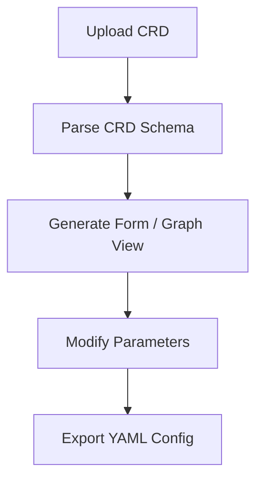

# 🧩 crd2yaml
A CRD → YAML visual configuration generator

---

## 🚀 How to Run

### 1️⃣ Run it in the Cloud (e.g., GCP Cloud Run)

```bash
export PROJECT_ID=<PROJECT_ID>
export REGION=<REGION>            # e.g. us-central1
export LOCAL_BUILD=true           # build locally instead of Cloud Build
export LOCAL_BUILD_TOOL=<podman|docker>
export LOCAL_PREBUILD=true        # run npm install && npm run build locally

bash deploy-cloudrun.sh
```
Open https://<cloudrun-url> in your browser.


### 2️⃣ Run it Locally

```bash
npm install
npm run dev
```
Open http://localhost:5173 in your browser.

### 3️⃣ Run it as a Container/Pod

Build the image locally or use the prebuilt version.

- Local build

```bash
# Example:
# docker build -t <repo>/<image>:<tag> .
```

- Run a pod on a local Kubernetes cluster

```bash
kubectl apply -f k8s-visual-crd.yaml
kubectl port-forward svc/visual-crd 8080:12080
```
Open http://localhost:12080 in your browser.

- Prebuilt image

```bash
docker pull pjablonski123/visual-crd:latest
```
Open http://localhost:8080 in your browser.

---

## 🧠 How to Use

- Upload or search for a CRD on GitHub.
  - The GitHub token is optional and stored on the client side only.
- Upload or search for configuration YAML examples.
- Explore CRD parameters via an auto-generated form and a Mermaid diagram.
- Modify parameters as needed using the generated form.
- Download the generated YAML configuration file.

---

## 🧾 Example Workflow



---

## 🧰 Technologies Used

- Node.js / React – UI and logic
- Mermaid.js – CRD visualization
- GitHub API – CRD and YAML discovery
- Cloud Run / Docker / Podman – deployment

---

## 🪪 License

This project is released under the Apache License 2.0.  
You are free to use, modify, and distribute it under the terms of that license.  
See the LICENSE file for details.

---

## 🤖 AI Generation Note

Human-led project development. The project’s code and documentation were generated using an LLM. Then human edits focused on testing, deployment, and formatting.

---

## 👥 Contributing

1. Fork the repository.
2. Create a feature branch: `git checkout -b feat/my-change`
3. Make your changes and add tests if applicable.
4. Commit and push: `git push origin feat/my-change`
5. Open a Pull Request and describe the changes.
